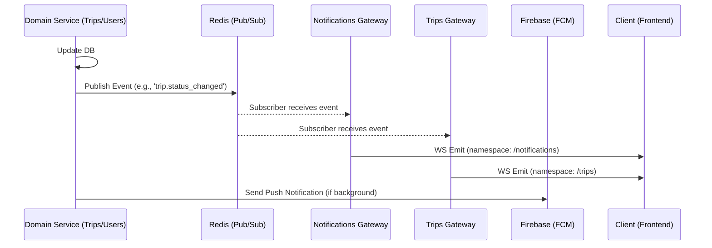

# Production Architecture: Notification & Real-time System

## 1. Overview

The system is built on a scalable, event-driven architecture using NestJS, Redis Pub/Sub, and Socket.IO. It decouples business logic from real-time signaling.

## 2. Event Flow Diagram



## 3. Redis Channel Naming Conventions

- `refresh.notifications`: Refresh signals for general notification updates.
- `refresh.users`: Refresh signals for user-management screens (Approval List, etc.).
- `refresh.trips`: Refresh signals for trip and vehicle-management screens.
- `notifications.refresh`: Refresh signals for general notification updates.
- `users.refresh`: Refresh signals for user-management screens (Approval List, etc.).
- `trips.refresh`: Refresh signals for trip and vehicle-management screens.

## 4. WebSocket Namespaces & Events

All gateways emit a standard `refresh` event with the following payload:
`{ "type": "REFRESH", "scope": "..." }`

| Namespace        | Scope Examples (NotificationType)   | Triggering Service   |
| :--------------- | :---------------------------------- | :------------------- |
| `/notifications` | `SYSTEM_ALERT`, `ALL`               | NotificationsService |
| `/trips`         | `TRIP_APPROVED`, `VEHICLE_ASSIGNED` | NotificationsService |
| `/users`         | `USER_REGISTERED`, `USER_APPROVED`  | NotificationsService |

## 5. Firebase Payload Structure

```json
{
  "notification": {
    "title": "Trip Approved",
    "body": "Your trip request #42 has been approved."
  },
  "data": {
    "type": "TRIP_APPROVED",
    "tripId": "42",
    "click_action": "FLUTTER_NOTIFICATION_CLICK"
  }
}
```

## 6. Environment Variables

- `REDIS_HOST`, `REDIS_PORT`, `REDIS_PASSWORD`
- `FIREBASE_CREDENTIALS` (JSON or path)
- `WS_PORT` (if separate from main API)

## 7. Scaling Notes

- By using Redis Pub/Sub, multiple backend instances can run behind a Load Balancer.
- When Instance A receives an API call, it publishes to Redis.
- Instance B and C (which have WebSocket connections from other clients) receive the Redis event and emit to their connected clients.
